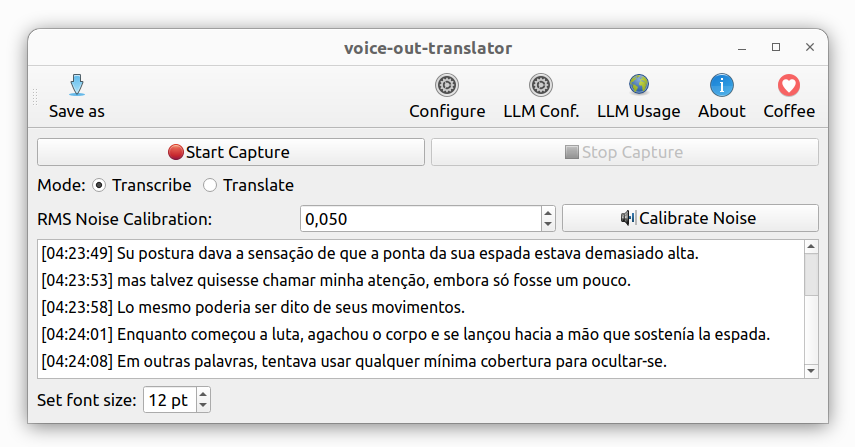

# voice-out-translator

Captures and translates/transcribes computer audio output in real-time.
This application monitors your computer's audio output (system audio, applications, browser audio, etc.) by creating a virtual copy of the audio stream. It then processes this captured audio using speech-to-text technology to provide live transcription or translation of any spoken content playing through your system.

**CURRENTLY ONLY WORKS ON LINUX**



## 1. Installing

To install the package from [PyPI](https://pypi.org/project/voice_out_translator/), follow the instructions below:


```bash
pip install --upgrade voice_out_translator
```

Execute `which voice-out-translator` to see where it was installed, probably in `/home/USERNAME/.local/bin/voice-out-translator`.

### Using

To start, use the command below:

```bash
voice-out-translator
```
## 2. More information

If you want more information go to [doc](https://github.com/trucomanx-voice/VoiceOutTranslator/blob/main/doc) directory

## 3. Buy me a coffee

If you find this tool useful and would like to support its development, you can buy me a coffee!  
Your donations help keep the project running and improve future updates.  

[☕ Buy me a coffee](https://ko-fi.com/trucomanx) 

## 4. License

This project is licensed under the GPL license. See the `LICENSE` file for more details.
